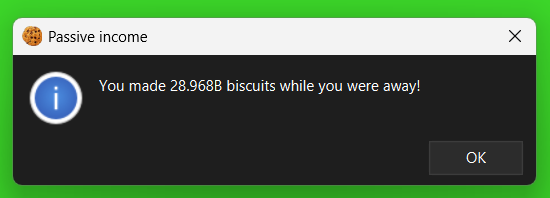
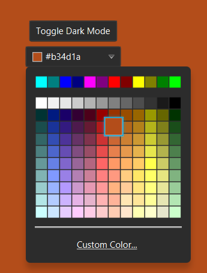
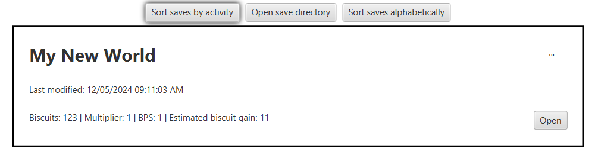

# BiscuitBlitzer

BiscuitBlitzer is an idle game built using JavaFX, featuring simple graphics and straightforward mechanics.

## Project Overview

I initially started this project as a remake of my [AP CSA Final Project](https://github.com/yash-dhore/FinalProject). Throughout the development process, I made significant improvements and expanded the gameplay experience. I have plans to add even more exciting features in the future, so stay tuned for updates!

## Features

- **Idle Mechanics**: Let your biscuit blitz even when you’re not playing!
- **Upgrades**: Purchase upgrades to increase your biscuit blitzing capabilities.
- **Dynamic Events**: Participate in special events that temporarily boost your biscuit blitzing.
- **Achievements**: Unlock milestones and hidden secrets as you play!
- **Statistics Tracking**: Monitor your progress with detailed statistics.

## Future Plans
I’m working on enhancing the game. Upcoming features include:
- Graphical improvements
- More ways to upgrade your biscuit-blitzing empire
- And more!

**Earn passive income!**  


**Customize your game!**  


**Save your games!**  


## Getting Started

### Prerequisites

- Java Development Kit (JDK) 11 or higher
- Apache Maven

### Installation

1. Clone the repository:
   ```bash
   git clone https://github.com/yash-dhore/BiscuitBlitzer.git
   ```
2. Navigate to the project directory:
   ```bash
   cd BiscuitBlitzer
   ```
3. Resolve dependencies:
   ```bash
   mvn dependency:resolve
   ```
4. Run the application:
   ```bash
   mvn clean javafx:run
   ```

## Thanks for Checking It Out!

I appreciate you taking the time to explore BiscuitBlitzer! I’m excited to learn and improve with each update. Your feedback is welcome, so feel free to share any thoughts or suggestions.

And don't forget to stay tuned for future updates as I continue to enhance the game.
